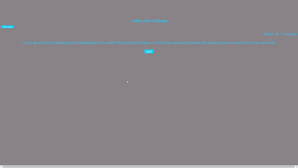
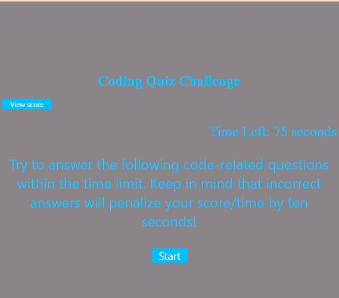

# Coding Quiz

## Description
Coding Quiz is a fun application that present user is given 75 seconds to answer a multiple choice test. When an incorrect answer is choosen, the timer is decrease by 10 seconds. At the end the user is able to store its initials and score.
I felt motivated to create this app to help with interview readiness.


## Table of Contents 

- [Webpage-Preview](#Webpage-Preview)
- [Code-Snippet](#Code-Snippet)
- [Custom-Features](#Custom-Features)
- [Usage](#Usage)
- [Skill-Improved](#Skill-Improved)
- [Technologies](#Technologies)
- [Authors](#Authors)
- [Credits](#credits)


## Webpage Preview



## Code-Snippet
Java script
#Funtion to decrement timer

```
function decrementTimer() {
    secondsLeft--;
    timeLeft.textContent = "Time left: " + secondsLeft + " s";
    if (secondsLeft <= 0 || secondsLeft === -1) {
        secondsLeft = 0;
        timeLeft.textContent = "Time left: " + secondsLeft + " s";
        endGame();
    }
}
```
#Function to handle timer decrement

```
function countdown() {

    timerInterval = setInterval(decrementTimer, 1000)

}

```
#Function to start quiz

```
function startGame() {
    //toggle start-page to show and hide//
    var startPage = document.getElementById("start-page");
    startPage.classList.add('hide');
    quizDiv.classList.remove("hide")
    countdown()
    askQuestion();
}

```


## Custome-Features
- Time interval function.
- Time decrement when a wrong choice is clicked.
- Feadback of wrong or correct when a answer is clicked.
- Timeout function to control feedback time on the screen.
- Local storage used to save score.


## Usage
The link of the webpage is:  https://clcoder2425.github.io/Quiz/
1. Load the webpage.
2. Click on the start button
3. Answer the questions by clickling on the correct answer. if answer is correct/wrong, an alert will display below.
4. When there are not more questions or the timer runs out, your total score wil be display.
6. Save your score with your initials. You can play as many times as you want and view your score arrange from the highest to the lowest.

Webpage use example:


    

    
## Skills Improved
- CSS Gap property, complementary colors.
- HTML center element.
- Timerinterval and timeout.
- DOM manipulation: window.location, document.getElementById, etc.


## Technologies
 - [HTML](#HTML)
 - [CSS](#CSS)
 - [JavaScript](#JavaScript)
## License
  [](https://opensource.org/licenses/MIT)

## Authors
- [Carmen-Jimenez](#Carmen Jimenez https://github.com/clcoder2425/)

## Credits

- [W3School](W3School)
- [StackOverflow](https://stackoverflow.com)

## Tutorials:
- [Josh-Comeau](https://www.joshwcomeau.com/animation/css-transitions/#introduction)


